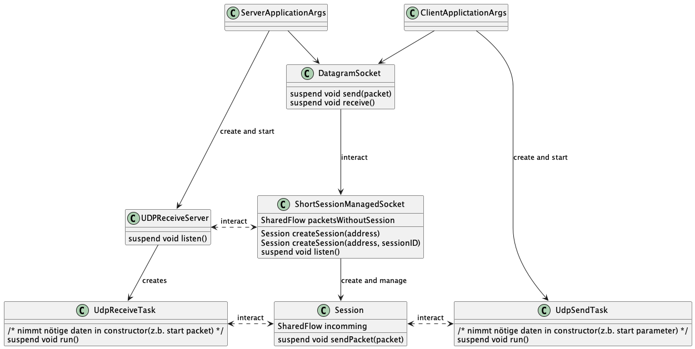

# Programmaufbau

Im großen und ganzen ist das Programm in drei Teile aufgeteilt:

1. Der commandline teil etc.
2. Der netzwerk teil.
3. Kleine extras und tools.

## Commandline teil

Die aufgabe diesses Teils ist es, die commandozeilen parameter zu parsen und zu überprüfen
wenn dies geschehen ist, werden die parameter and den Netzwerkteil weitergegeben und dieser getartet.

## Netzwerk teil

Der Netzwerk Teil ist der größte teil er implementiert den eigentlichen Server und Client.
Beide bestehen aus einem Session layer, welcher die packete nach ihrerer session id aufteilt, und einem jeweiligen
Send/Receive Task, welcher auf dem session layer aufbaut.
Der server hat noch zusätzlich einen accept task, welcher auf eingehende Verbindungen entgegen nimmt.

Client und Server sind mit der go back n strategie implementiert.
Diese händeln sie mittels eines Zustandes.
Beim client anthält dieser die bgesendeten sowie die gesendeten pakete.
Mit diesem handhabt er nicht nur das erneute senden von packeten sondern auch die einhaltung des sendefensters.
Server server hält einen zustand des letzen empfangenen packetes sowie das offene sendefenster.
Packete im sendefenster werden werden gerordnet packete außerhalb des sendefensters werden verworfen jedoch beantwortet
mit einer außnahme. 64 packetids vor den sendefester werden reserviert und werden verworfen und nicht beatwortet. Dies
soll verhindern das clients welche das limits des sendefesters nich befolgen packete für empfangen halten welche
verworfen wurden packet welche.

### Session Layer

Der Session Layer ist für die Aufteilung der Packete nach ihrer Session ID zuständig.
Hierfür können session instanzen angelegt werden. Gehört ein packet keiner bekannten session an, wird es an eine
gesonderte "pipeline"(shared flow) weitergeleitet.
Der server liest diese pipeline aus, um start-packet zu empfangen und neue sessions zu erstellen.
Der client weist lediglich darauf hin das eine packet ohne gültige session empfangen wurde.

